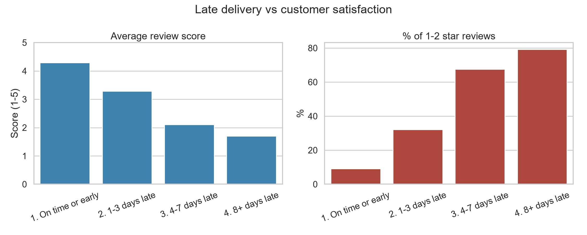
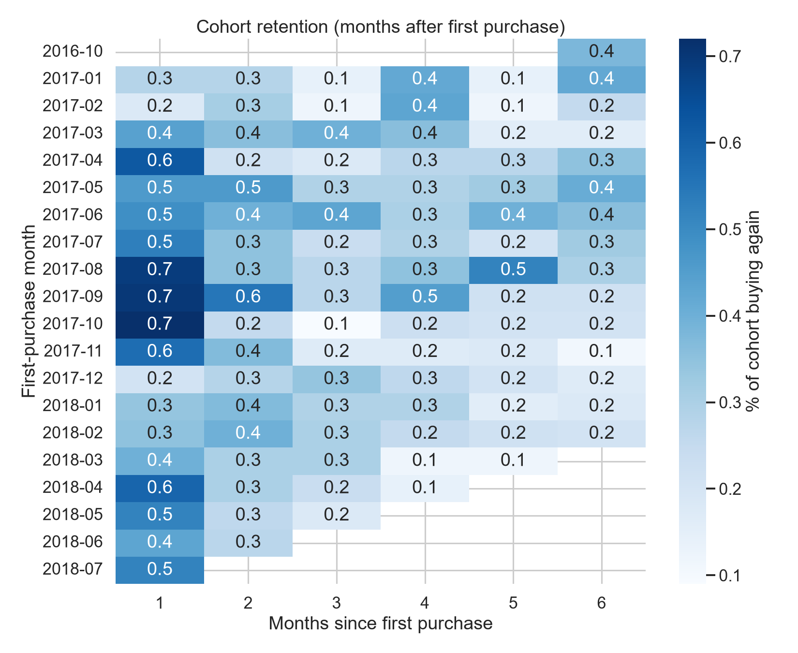
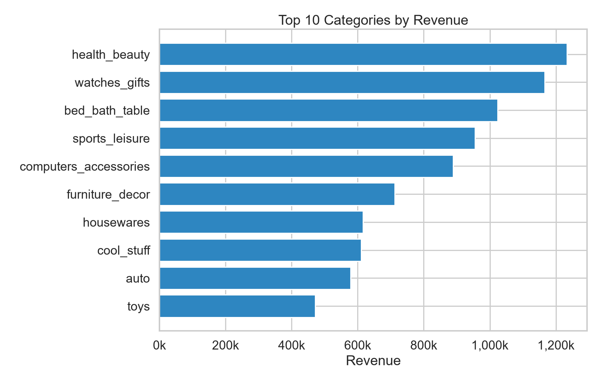
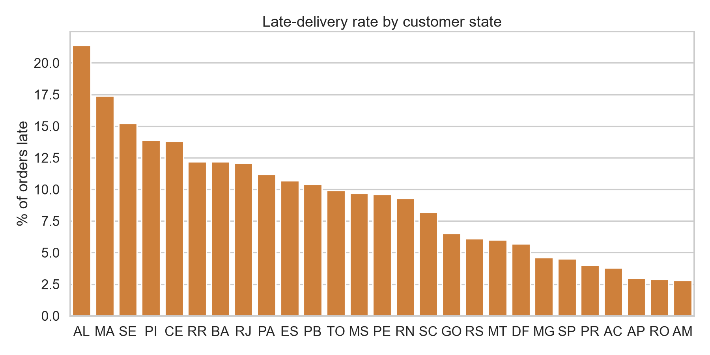
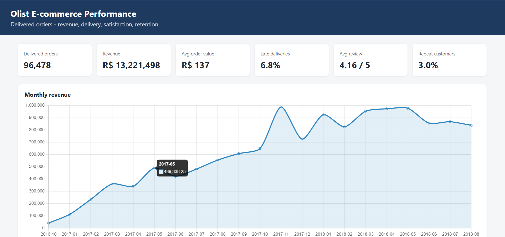

# Olist E-commerce Analytics (SQL + Python + Dashboard)

End-to-end analysis of ~100k Brazilian e-commerce orders across 8 related tables.
Focus: **SQL on relational data**, validated against an independent pandas calculation, with a dashboard on top.

## Business questions
1. Do late deliveries lower customer review scores, and by how much?
2. How many customers buy again? How well do monthly cohorts retain?
3. Which categories and states drive revenue, and where is delivery worst?
4. How are payment methods used?
5. Which sellers have the worst delivery performance?

## Dataset
[Brazilian E-Commerce Public Dataset by Olist](https://www.kaggle.com/datasets/olistbr/brazilian-ecommerce) (Kaggle).
Download, unzip, and put the CSVs in a `data/` folder next to these scripts.

## Run
```
pip install -r requirements.txt
python 01_build_database.py data     # data-quality report + SQLite DB + order_facts view
python 02_run_analysis.py data       # 9 SQL queries, 12 validation checks, 5 charts, findings.md
python 03_build_dashboard.py         # outputs/dashboard.html (open in browser)
```

## What this demonstrates
| Skill | Where |
|---|---|
| Multi-table joins, LEFT JOIN, aggregate-before-join to avoid fan-out | `sql/01_order_facts_view.sql` |
| CTEs, window functions (`LAG`, `RANK`, running totals, share-of-total) | `monthly_revenue`, `top_categories`, `seller_scorecard` |
| `GROUP BY` / `HAVING` | `state_summary`, `seller_scorecard` |
| Cohort retention analysis | `cohort_retention` |
| Data-quality checks and documented decisions | `01_build_database.py` |
| SQL results validated against pandas (12 checks incl. fan-out guard) | `02_run_analysis.py` |
| Dashboard | `03_build_dashboard.py` |

## Data pitfalls handled
- `customer_id` is unique **per order**; repeat-purchase analysis uses `customer_unique_id`.
- Orders can have several items, payment rows and reviews, so joining raw tables inflates revenue. Each is aggregated to one row per order first, and a check confirms `order_facts` has exactly one row per order.
- Revenue is item price on **delivered** orders only (freight excluded); cancelled/unavailable orders are kept in the database but excluded from revenue.
- Delivered orders missing a delivery date are excluded from delivery metrics; lateness is compared by date, not timestamp.
- The first and last months of the dataset have very few orders and are excluded from trend charts.

## Key findings

**1. Late delivery is strongly associated with low review scores.**
Orders delivered on time average 4.29 stars, versus 1.70 for orders 8+ days late. 79% of reviews on
the latest orders are 1–2 stars, compared with 9% for on-time orders. Only 6.7% of delivered orders
arrive after the estimated date, so this looks like a targeted problem rather than a systemic one.



**2. Repeat purchasing is very low.**
Only 3.0% of customers ordered more than once, and one-time buyers generate 94.5% of revenue.
Revenue depends almost entirely on acquiring new customers.



**3. Revenue is spread across many categories.**
health_beauty is the largest category (9.3% of revenue); the top three together make up 25.9%.



**4. Late-delivery rates vary widely by state.**
From 2.8% in AM to 21.4% in AL (states with at least 30 delivered orders; small states are noisier).



**5. Payments.** Credit card accounts for the largest share of payment value.

## Dashboard


## Recommendations for management to investigate
- Review carrier performance and delivery estimates in the highest-late-rate states (e.g. AL), and
  set more realistic delivery dates, since lateness is linked to poor ratings.
- Investigate the sellers with the highest late rates (`seller_scorecard` query) to find out whether
  the delays come from seller handling time or from carriers.
- Test a post-purchase retention campaign (e.g. email or voucher after delivery), since only 3.0% of
  customers return.
- Check whether the best-selling categories also have the worst delivery times or lowest reviews.

## Limitations
This is observational data: late delivery and low scores are associated, but not proven causal.
Review scores are self-selected, and cohort months with few customers are noisy. Customers are
identified by `customer_unique_id`, so one person using different accounts would be counted twice.

## Author
Hamza: Computer Science Student | Aspiring Data Analyst